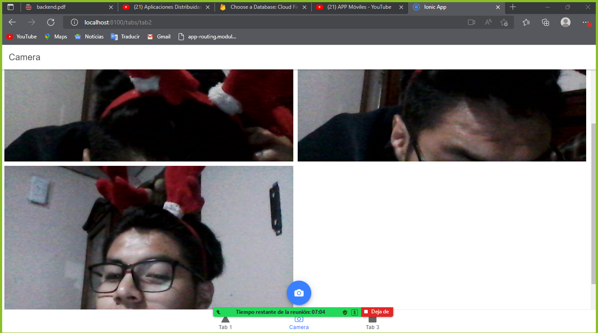
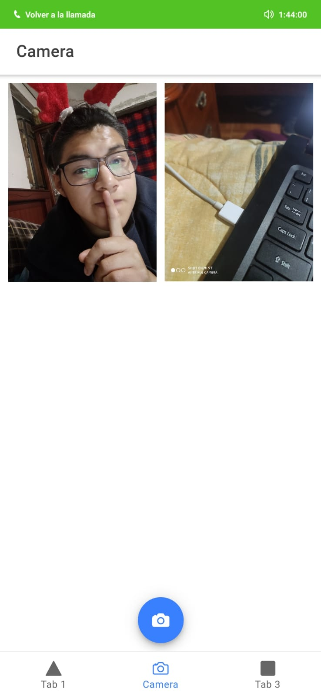

## Primera Ionic App camera
Se presenta la evidencia de la funcionalidad

## Capturas
### Ejecucion en el navegador 
  
 

### Ejecucion en el movil
  
 

### Galeria en el navegador
  
 

### Galeria en el movil
  
 
